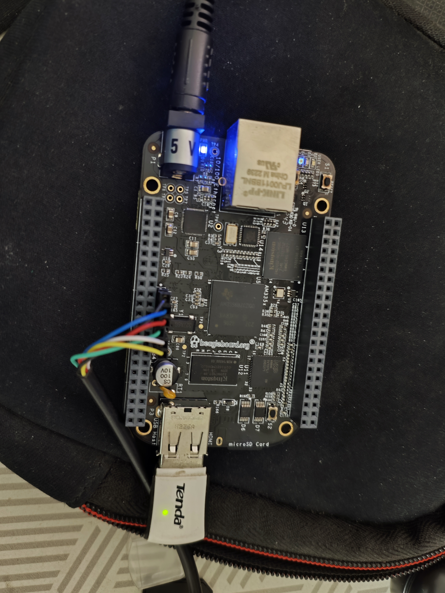

## 🛠️ Tinkering with Boards

I enjoy tinkering with embedded development boards as a hobby, with a strong focus on hands-on experimentation and low-level system understanding. Most of these projects begin from a bare or semi-bare state—bringing up boards from scratch, flashing custom bootloaders or Linux images, and gradually enabling system functionality piece by piece.

This hobby project documents my end-to-end experience of bringing up an embedded Linux system on the BeagleBone Black (AM335x) using Buildroot. The intent was not to build an application-heavy product, but to deeply understand the fundamentals of board bring-up, boot-time behavior, and system reliability in a headless embedded setup.

### Project Overview

The project demonstrates a complete embedded Linux bring-up flow—from image generation to first boot and network availability. The goal was to create a bootable, reproducible Linux image that provides WiFi connectivity and SSH access out-of-the-box, making the board usable immediately after power-up without requiring a display, keyboard, or manual intervention.

The emphasis throughout the project was on:
- Practical board bring-up
- Boot-time automation
- Debug-friendly system design

### Why This Project Matters

For embedded Linux roles, one of the most critical skills is the ability to take a bare board and make it:

- boot reliably
- connect to a network
- support remote access
- remain debuggable

This hobby project focuses squarely on those fundamentals. It showcases how industry-standard tools and workflows can be used to build a minimal yet functional embedded Linux system suitable for real-world, headless deployments.

### What I Implemented

#### 1. Custom Buildroot Linux Image

I generated a custom, bootable SD card image for the BeagleBone Black (AM335x) using Buildroot. This involved configuring and building the complete embedded Linux stack, including:

- Bootloader
- Linux kernel
- Minimal root filesystem

The build process produced ready-to-flash artifacts such as:
- `sdcard.img`
- Kernel and boot partition images

This enabled repeatable builds and rapid re-provisioning during experimentation.

#### 2. Automated WiFi Bring-Up at Boot

To support headless usage, I implemented a boot-time WiFi initialization script that runs automatically on the target device. The script performs the following steps:

- Brings up the `wlan0` interface
- Starts `wpa_supplicant` using the `nl80211` backend
- Waits for access point association
- Acquires an IP address using `udhcpc`
- Writes detailed logs to `/tmp/wifi-init.log` for debugging

This ensures the system becomes network-accessible immediately after boot, without manual intervention.

### Project Nature

This work was completed as a self-driven hobby project focused on learning through experimentation. The emphasis was on understanding boot-time behavior, identifying failure points, and debugging issues methodically rather than building a polished end-user product.

The project reflects a curiosity-driven approach to embedded systems—treating the board as a learning platform rather than a black box.
